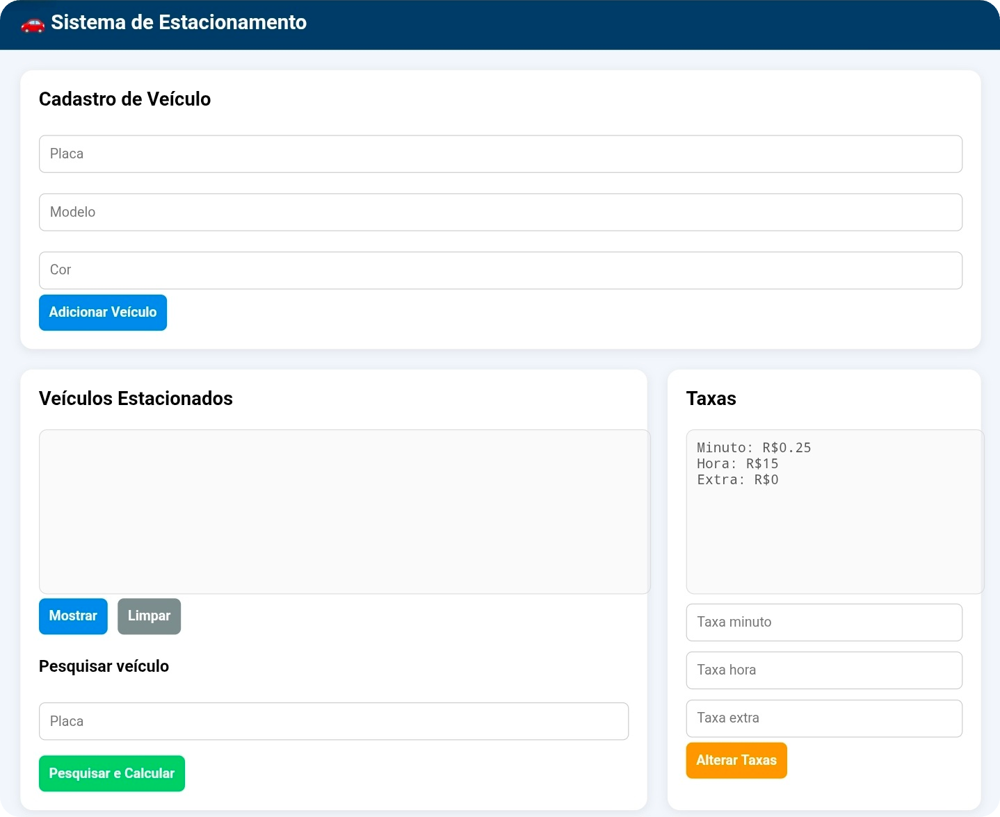

# Parking Management System

A parking management system built with **HTML, CSS, and vanilla JavaScript**. It supports vehicle registration, listing, search, and automatic fee calculation based on parking duration.

---

## Features

- Register vehicles by license plate, model, and color
- List parked vehicles
- Search for a vehicle by license plate
- Calculate the amount due from the parking duration
- Configure per-minute, hourly, and additional fees
- Update information dynamically in the interface

---

## Technologies

- HTML5
- CSS3
- JavaScript (Vanilla JS)

---

## How It Works

Vehicle records are stored in a JavaScript array together with their entry date and time.

When a vehicle is retrieved, the system:

1. Calculates the elapsed time since entry.
2. Converts the duration into hours and minutes.
3. Applies the configured fees.
4. Displays the final amount due.

---

## Project Interface

